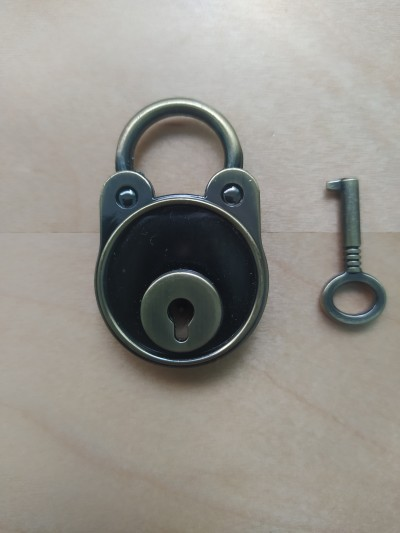
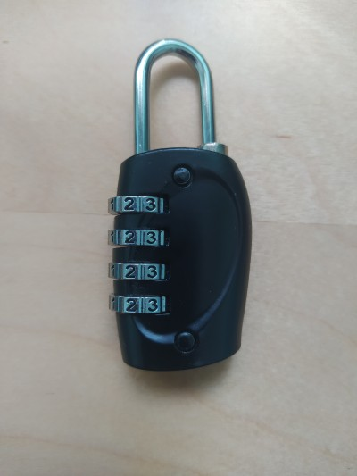
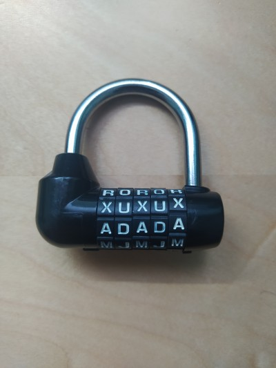
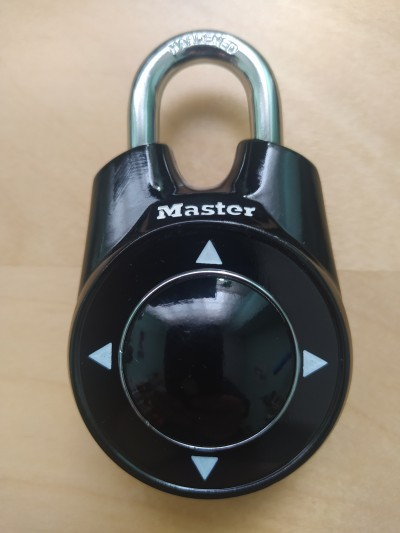
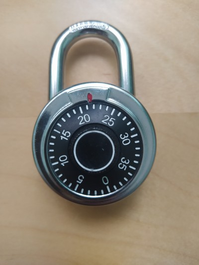

# Escape box
## Juego escape matemático

¡Bienvenida/os a _Escape Box_, el juego de escape matemático!

El objetivo de este juego de escape es abrir todas las cajas antes de 1 hora. Para ello tendréis que resolver distintas pruebas matemáticas y de lógica que os darán las combinaciones para abrir los candados o las herramientas necesarias para abrir las cajas.  ¿Seréis capaces?

## Instrucciones

1. No se puede mover la caja (levantarla, girarla, darle la vuelta, etc.), pero si se pueden sacar los cajones por completo.
   
2. No podéis utilizar otros instrumentos que no sean los que encontréis dentro de los cajones.

3. Existen varios tipos de candados. A continuación tienes las instrucciones para abrir cada tipo.

    **Candado de llave**. 
    
    

    Este candado se abre con una llave que tendréis que encontrar.

    **Candado de combinación numérica**. 
    
    
    
    Este candado se abre con una combinación numérica que tendréis que adivinar.
    
    **Candado de combinación alfabética**. 
    
    

    Este candado se abre con una combinación de letras que tendréis que adivinar.

    **Candado de movimientos**. 
    
    

    Este candado se habre con una secuencia de movimientos (izquierda, derecha, arriba, abajo) que tendréis que adivinar. Para probar una nueva combinación tendréis que presionar dos veces sobre el arco de cierre del candado.
    
    **Candado de ruleta**. 
    
    
    
    Este candado se abre con una combinación de tres números. Para introducir una combinación nueva primero hay que dar al menos dos vueltas completas a la ruleta en el sentido de las agujas del reloj y parar con el primer número de la combinación en la marca roja. Después hay que dar una vuelta completa en el sentido contrario a las agujas del reloj y parar en el segundo número de la combinación. Finalmente hay que volver a girar la ruleta en el sentido de las agujas del reloj, esta vez sin necesidad de dar una vuelta completa, y parar en el tercer número de la combinación.

4. Tenéis un comodín para pedir una pista si en algún momento estáis bloqueados.

¿Está todo claro? Pues si estáis listos, aquí tenéis la [primera pista](/cuadrado_magico.md).
