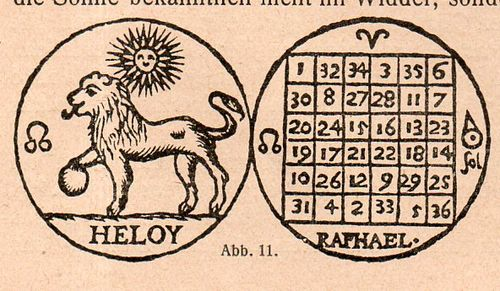

# Escape box
## Solución

### Primera pista 

Cuadrado mágico del sol.

**Respuesta**: La suma de los números de las filas, columnas o diagonales del cuadrado mágico es 111.

**Abre**: Candado vaca, cajón superior derecho.

**Objetos**: Espejo, cinta y triángulo caballo.

### Segunda pista

Texto invertido pegado en el techo con fuente pequeña.

Un joven aprendiz empieza a trabajar con un salario de 1€ al día, pero cada día que pasa, si hace bien su trabajo, recibe 1€ más que el día anterior. ¿Cuánto dinero tendrá al cabo de 100 días?

**Respuesta**: 5050

**Abre**: Candado de combinación numérica de 4 dígitos, cajón superior izquierdo.

**Objetos**: Escítala (palo para envolver la cinta). LLave en la base del cajón.

### Tercera pista

Usar la escítala y la cuerda para obtener la combinación del candado de movimientos.

**Respuesta**: Derecha, Izquierda, Izquierda, Abajo.

**Abre**: Candado de movimientos, cajón derecho.

**Objetos**: Hexaflexágono y linterna ultravioleta.

### Cuarta pista

Hexaflexágono. 

**Respuesta**: Obtener la combinación en la cara del caballo: 708015. Convertir a hexadecimal: ACDAF.

**Abre**: Candado de combinación de letras, cajón izquierdo.

**Objetos**: Tijeras y acertijo matemático.

### Quinta pista

Tijeras. 

**Respuesta**: Cortar la brida con las tijeras y abrir el candado con la llave. 

**Abre**: cajón bajo.

**Objetos**: Agenda

### Sexta pista

Acertijo matemático. 

Dos viejos amigos matemáticos se vuelven a ver 20 años después de acabar el grado. 

Uno le dice al otro: _desde que no nos vemos he tenido 3 hijas._ 

El segundo pregunta: _¿Y qué edades tienen?_

El primero le responde: _El producto de sus edades es 36, y la suma de sus edades coincide con las dos últimas cifras de tu teléfono_. 

El segundo, después de pensar un rato, contesta: _si, pero me falta un dato._ 

A lo que el primero replica: _Ah sí, cierto. La mayor toca el piano.

¿Cuáles son las edades de la hijas?

**Respuesta**: 2, 2 y 9.

**Abre**: Agenda

### Séptima pista

Calcular los valores de $x$ en los que la función $f(x)$ tiene una raíz, un máximo y un punto de inflexión.

- Función agenda 1: $f(x)=x^3-90x^2+825x+25508$.
- Función agenda 2: 
- Función agenda 3: $f(x)=x^3-90x^2+1932x+432$.
- Función agenda 4: $f(x)=x^3-1323x-1702$.

**Respuesta**: 

- Agenda 1: Raíz 28, extremo 5 y punto inflexión 30.
- Agenda 2: 
- Agenda 3: Raíz 36, extremo 14 y punto inflexión 30.
- Agenda 4: Raíz 37, extremo 21 y punto inflexión 0.

**Abre**: Candado de ruleta, cajón central arriba.

- Candado 1: 28-5-30
- Candado 2: 
- Candado 3: 36-14-30
- Candado 4: 37-21-0

